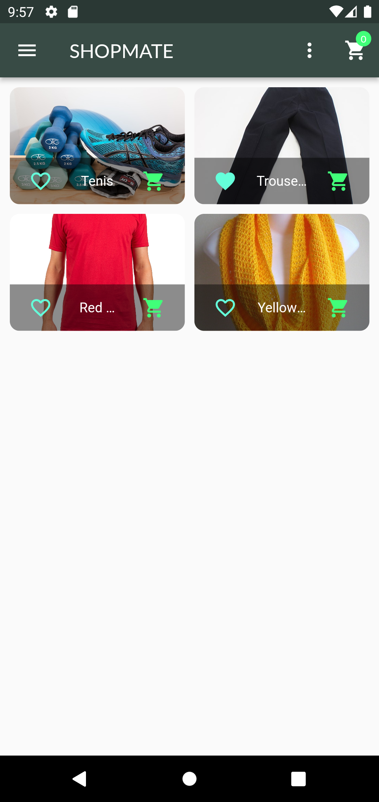
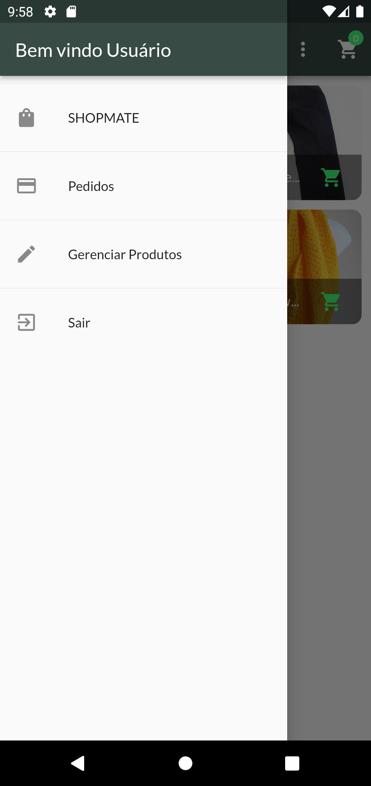
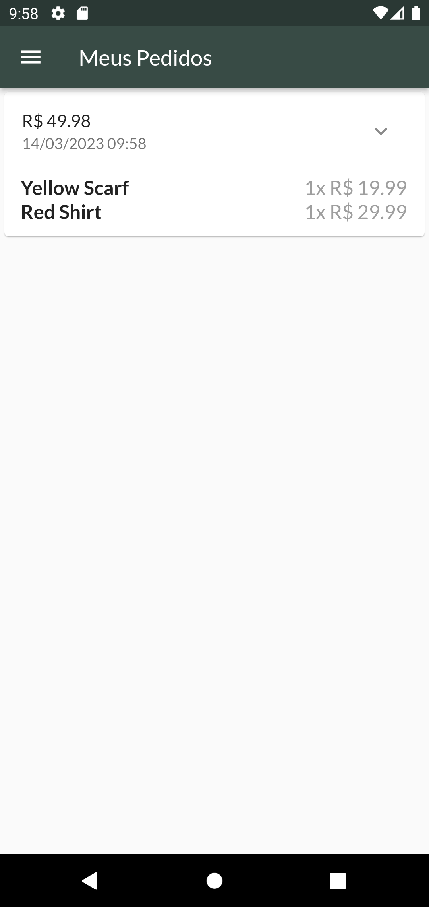
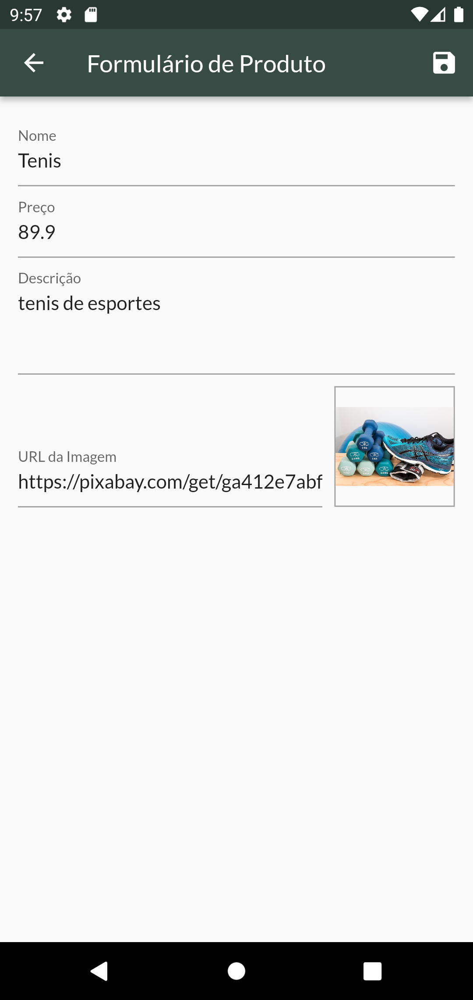

# Shopmate

Shopmate is a Flutter application developed for the purpose of learning and improving skills in building forms in Flutter, working with authentication, state management, sending HTTP requests, and working with animations, among other things.

## Technologies

The following technologies and libraries were used in the development of this project:

[](https://flutter.dev/)
[](https://dart.dev/)
[](https://firebase.google.com/)
[](https://pub.dev/packages/http)
[](https://pub.dev/packages/get)

## Screenshots

Below are some screenshots of the Shopmate app:

<div style="display:flex; flex-direction: row; justify-content: space-evenly; margin-top: 20px;">
  
  
  
  
  
</div>

## Get Started

Before running the application, it is necessary to create a `.env` file manually or by running the setup scripts to add the values of `BASE_URL` for Firebase Runtime Storage and `API_KEY`, which are required for the application to run.

To get started with the project, follow these steps:

1. Clone the repository:

  ```
  git clone https://github.com/faamaral/shopmate.git
  ```

2. Create a `.env` file with the required variables (see example in `.env.example`).
3. Run the following command to install the project dependencies:

  ```
  flutter pub get
  ```

4. Run the project:

  ```
  flutter run
  ```

## Contributions

Contributions to the project are welcome. To contribute, please fork the repository, create a new branch, make your changes, and submit a pull request.

## License

This project is licensed under the MIT License. See the [LICENSE](/LICENSE) file for details.
